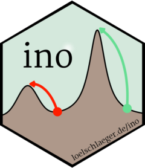
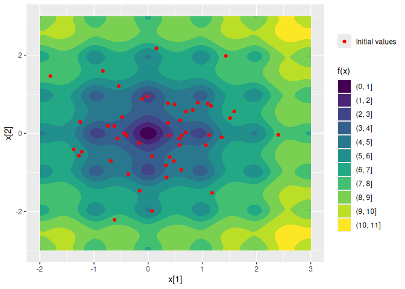
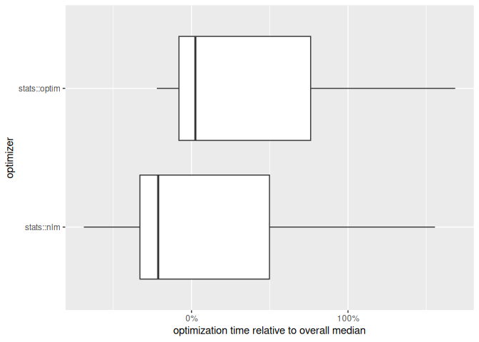

<!-- README.md is generated from README.Rmd. Please edit that file -->

# Initialization of numerical optimization <a href="https://loelschlaeger.de/ino/"></a>

<!-- badges: start -->

[](https://CRAN.R-project.org/package=ino)
[](https://CRAN.R-project.org/package=ino)
[](https://github.com/loelschlaeger/ino/actions)
[](https://app.codecov.io/gh/loelschlaeger/ino?branch=master)
<!-- badges: end -->

The `{ino}` R package provides a framework for analyzing the role of
initialization in numerical optimization. It allows for systematic
comparisons of different initialization strategies and optimization
algorithms using a unified `R6` object called
[`Nop`](https://loelschlaeger.de/ino/reference/Nop.html).

## Installation

You can install the released version from
[CRAN](https://CRAN.R-project.org) with:

``` r
install.packages("ino")
```

## Example

The [Ackley function](https://en.wikipedia.org/wiki/Ackley_function) has
multiple local minima and one global minimum at the origin. We define

1.  the numerical optimization problem as a `Nop` object,
2.  two optimization algorithms `stats::nlm()` and `stats::optim()`, and
3.  40 randomly drawn initial values:

``` r
library("ino")
set.seed(1)
Nop_ackley <- Nop$new(f = TestFunctions::TF_ackley, npar = 2)$
  set_optimizer(optimizeR::Optimizer$new("stats::nlm"))$
  set_optimizer(optimizeR::Optimizer$new("stats::optim"))$
  initialize_random(runs = 40)
```

We can visualize the function surface along with the initial values:

``` r
library("ggplot2")
Nop_ackley |> autoplot()
```



Next, we optimize the function via the previously defined initial values
and optimizers:

``` r
Nop_ackley$optimize()
```

In this example, `stats::nlm()` appears to be both faster…

``` r
Nop_ackley$results |> 
  ggplot2::autoplot("seconds", group_by = "optimizer", relative = TRUE) +
  ggplot2::scale_x_continuous(labels = scales::percent_format()) +
  ggplot2::labs(
    "x" = "optimization time relative to overall median",
    "y" = "optimizer"
  )
```



… and more effective at locating the global minimum:

``` r
Nop_ackley$optima(digits = 2, group_by = "optimizer")
#> $`stats::nlm`
#> # A tibble: 5 × 2
#>   value     n
#>   <dbl> <int>
#> 1  0       13
#> 2  2.58    13
#> 3  3.57    10
#> 4  5.38     3
#> 5  4.88     1
#> 
#> $`stats::optim`
#> # A tibble: 5 × 2
#>   value     n
#>   <dbl> <int>
#> 1  2.58    17
#> 2  0       12
#> 3  3.57     5
#> 4  4.88     3
#> 5  5.38     3
#> 
#> attr(,"class")
#> [1] "Nop_optima" "group_by"   "list"
```

Overall, (only) 25% of of the initializations successfully converged to
the global minimum.

## Contact

Have a question, found a bug, request a feature, want to contribute?
[Please file an
issue](https://github.com/loelschlaeger/ino/issues/new/choose).

## Related R packages

- The [{trackopt} package](https://CRAN.R-project.org/package=trackopt)
  tracks parameter value, gradient, and Hessian at each iteration of
  numerical optimizers in R. This can be useful for analyzing
  optimization progress, diagnosing issues, and studying convergence
  behavior.

- The [{optimizeR}
  package](https://CRAN.R-project.org/package=optimizeR) provides a
  unified object-oriented framework for numerical optimizers in R.
  Allows for both minimization and maximization with any optimizer,
  optimization over more than one function argument, measuring of
  computation time, setting a time limit for long optimization tasks.

- The [{ao} package](https://CRAN.R-project.org/package=ao) implements
  an iterative process that optimizes a function by alternately
  performing restricted optimization over parameter subsets. Instead of
  joint optimization, it breaks the optimization problem down into
  simpler sub-problems. This approach can make optimization feasible
  when joint optimization is too difficult.
