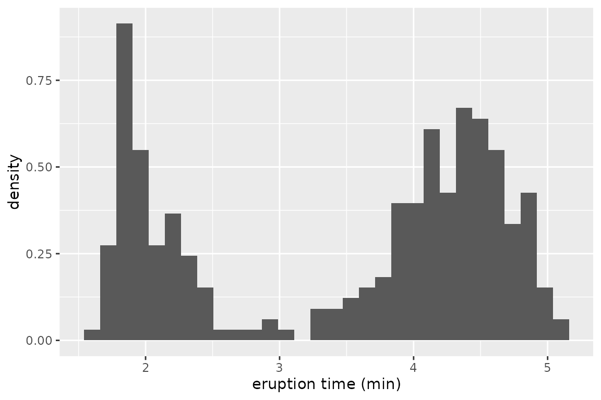
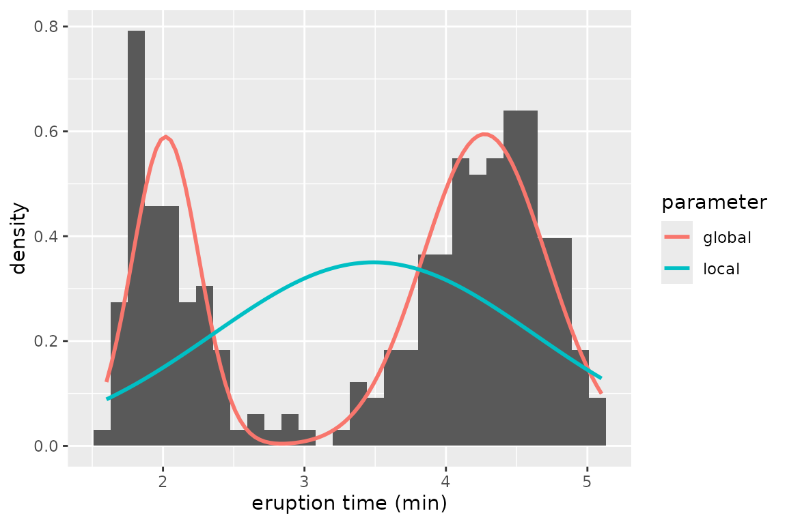
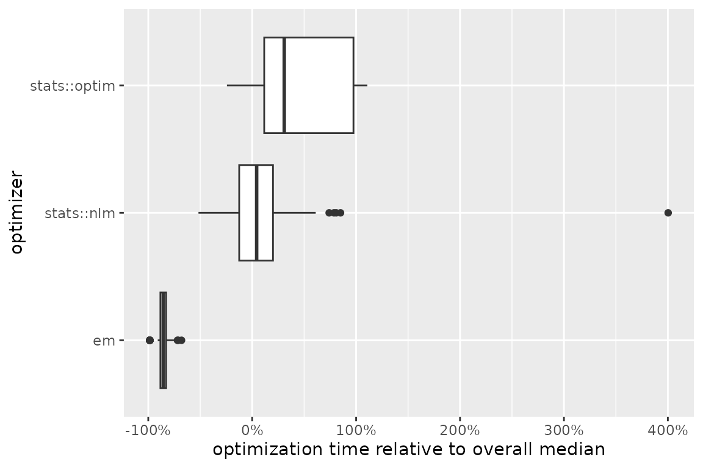

# Introduction to ino

## Motivation

Optimization aims to maximize effectiveness, efficiency, or
functionality in various fields. Examples include portfolio selection in
finance, minimizing air resistance in engineering, or likelihood
maximization in statistical modeling. The common goal is to find inputs
that produce an optimal output.

In some scenarios, determining optimality is feasible by analytical
means, for example with simple objective functions like
$`f:\mathbb{R} \to \mathbb{R},\ f(x) = -x^2`$. The first derivative
$`f'(x) = -2x`$ vanishes at $`x = 0`$, and since $`f`$ is strictly
concave, we conclude that $`x = 0`$ is the unique point where $`f(x)`$
is maximal. However, many optimization problems lack closed-form
solutions, requiring **numerical optimization**.

Numerical optimization encompasses algorithms that iteratively explore
the parameter space, seeking improvement in the function output with
each iteration and ultimately converging to a point where further
improvements are not possible ([Bonnans et al.
2006](#ref-Bonnans:2006)). R offers various implementations of such
algorithms[^1]. Common to all these algorithms is the necessity to
specify **initial parameter values**.

Crucially, initialization can strongly influence optimization time and
outcomes ([Nocedal and Wright 2006](#ref-Nocedal:2006)). Starting in
non-concave areas risks convergence issues or settling on local optima
instead of the global optimum, while starting in flat regions can slow
computation, which is especially critical when function evaluations are
costly. This raises two key questions:

1.  Does initialization affect my optimization problem?

2.  If so, what initial values ensure fast optimization leading to the
    global optimum?

## Package functionality

We introduce [ino](https://loelschlaeger.de/ino/), short for
**initialization of numerical optimization**, designed to address the
aforementioned questions:

1.  Investigation into the impact of initial values on optimization.

2.  Comparison of various initialization strategies.

3.  Comparison of different numerical optimizers.

Following an **object-oriented approach**[^2], the package treats
numerical optimization problems as objects. These objects are defined by
a real-valued function, its target arguments, and one or more
optimization algorithms. The object provides methods for selecting
initial values, executing numerical minimization or maximization, and
evaluating the optimization results.

The key advantages of using the [ino](https://loelschlaeger.de/ino/)
package include:

- Straightforward comparisons among optimizers and initialization
  strategies.

- Compatibility with any optimizer implemented in R for both
  minimization and maximization tasks through the
  [optimizeR](https://loelschlaeger.de/optimizeR/) framework
  ([Oelschläger and Ötting 2025](#ref-Oelschlaeger:2025)), detailed
  below.

- Support for parallel computation through the
  [future](https://future.futureverse.org) package ([Bengtsson
  2021](#ref-Bengtsson:2021)) and progress updates via the
  [progressr](https://progressr.futureverse.org) package ([Bengtsson
  2024](#ref-Bengtsson:2024)).

## Example workflow

To begin, obtain [ino](https://loelschlaeger.de/ino/) from
[CRAN](https://CRAN.R-project.org) via:

``` r

install.packages("ino")
library("ino")
```

### Gaussian mixture model

In this example, the function to be optimized is a likelihood function,
computing the probability of observing given data under a specified
model assumption. The parameters that maximize this likelihood function
are identified as the model estimates. This method, known as [maximum
likelihood
estimation](https://en.wikipedia.org/wiki/Maximum_likelihood_estimation),
is widely used in statistics for fitting models to empirical data.

We examine eruption times of the Old Faithful geyser in Yellowstone
National Park, Wyoming, USA. The data histogram suggests two clusters
with short and long eruption times, respectively:

``` r

library("ggplot2")
ggplot(faithful, aes(x = eruptions)) + 
  geom_histogram(aes(y = after_stat(density)), bins = 30) + 
  xlab("eruption time (min)") 
```



For both clusters, we assume a normal distribution, representing a
mixture of two Gaussian densities to model the overall eruption times.
The log-likelihood function[^3] is defined as:

``` math
\ell(\boldsymbol{\theta}) = \sum_{i=1}^n \log\Big( \lambda \phi_{\mu_1, \sigma_1^2}(x_i) + (1-\lambda)\phi_{\mu_2,\sigma_2^2} (x_i) \Big)
```

Here, the sum covers all observations $`1, \dots, n = 272`$,
$`\phi_{\mu_1, \sigma_1^2}`$ and $`\phi_{\mu_2, \sigma_2^2}`$ represent
the normal density for the first and second cluster, respectively, and
$`\lambda`$ is the mixing proportion.

Our objective is to find values for the parameter vector
$`\boldsymbol{\theta} = (\mu_1, \mu_2, \sigma_1, \sigma_2, \lambda)`$
that maximize $`\ell(\boldsymbol{\theta})`$. Due to the complexity of
the problem, analytical solutions are not available, therefore numerical
optimization is required.

> **Remark:** Numerical optimization in this example is fast due to the
> relatively small dataset and a model with only two classes. While
> initialization might seem less critical in this scenario, it becomes a
> more significant concern as the problem scales with more data and
> parameters ([Shireman et al. 2017](#ref-Shireman:2017)). Furthermore,
> even this seemingly simple optimization problem is susceptible to
> local optima, depending on the chosen initial values, as we will see
> below.

The following function computes the log-likelihood value
$`\ell(\boldsymbol{\theta})`$ given the parameters `mu`, `sigma`, and
`lambda` and the observation vector `data`:

``` r

normal_mixture_llk <- function(mu, sigma, lambda, data) {
  sigma <- exp(sigma)
  lambda <- plogis(lambda)
  sum(log(
    lambda * dnorm(data, mu[1], sigma[1]) +
      (1 - lambda) * dnorm(data, mu[2], sigma[2])
  ))
}
normal_mixture_llk(
  mu = 1:2, sigma = 3:4, lambda = 5, data = faithful$eruptions
)
#> [1] -1069.623
```

> **Remark:** To ensure positivity for the standard deviations `sigma`,
> we apply the exponential transformation. Similarly, to constrain
> `lambda` between $`0`$ and $`1`$, we use the logit transformation.
> This approach allows us to optimize over the value space
> $`\mathbb{R}^5`$ without the need for box-constrained optimizers.

### Initialization effect

Does the choice of initial values have an influence for this
optimization problem? In the following, we will use the
[ino](https://loelschlaeger.de/ino/) package to optimize the likelihood
function, starting from 100 random initial points, and compare the
results.

We start by defining the optimization problem:[^4]

``` r

Nop_mixture <- Nop$new(
  f = normal_mixture_llk,               # the objective function
  target = c("mu", "sigma", "lambda"),  # names of target arguments
  npar = c(2, 2, 1),                    # lengths of target arguments
  data = faithful$eruptions             # values for fixed arguments
)
```

The call `Nop$new()` creates a `Nop` object that defines a numerical
optimization problem. We have saved this object with the name
`Nop_mixture`. In the future, we can interact with this object by
invoking its methods using the syntax `Nop_mixture$<method name>()` or
its fields via `Nop_mixture$<field name>`.

The arguments for creating `Nop_mixture` are:

- `f`: the objective function to be optimized.
- `target`: the names of the target arguments over which `objective` is
  optimized.
- `npar`: the length of each of these target arguments.
- The argument `data` is provided, which remains constant during
  optimization.

Additionally, analytical gradient and Hessian function for `f` can be
provided if available.

Once the `Nop` object is defined, the objective function can be
evaluated at a specific value `at` for the collapsed target arguments:

``` r

Nop_mixture$evaluate(at = 1:5) # same values as above
#> [1] -1069.623
```

Next, we require a numerical optimizer. Here, we choose
[`stats::nlm()`](https://rdrr.io/r/stats/nlm.html):

``` r

nlm <- optimizeR::Optimizer$new(which = "stats::nlm")
Nop_mixture$set_optimizer(nlm)
```

Once an optimizer is specified, the process of optimizing the function
becomes straightforward:

1.  Define initial values using one of the `$initialize_*()` methods
    (detailed below).
2.  Call `$optimize()`.

``` r

set.seed(1)
Nop_mixture$
  initialize_random(runs = 20)$
  optimize(which_direction = "max", optimization_label = "random")
```

The method `$initialize_random(runs = 20)` generates 20 sets of random
initial values, with each set independently drawn from a standard normal
distribution by default. Subsequently,
`$optimize(which_direction = "max")` maximizes the function, starting
from these generated values. Setting an `optimization_label` is optional
but can be useful if different initialization strategies are compared.

The optimization results can be accessed through the `$results` field:

``` r

Nop_mixture$results
#> # A tibble: 20 × 13
#>    value parameter seconds initial error gradient  code iterations error_message
#>  * <dbl> <list>      <dbl> <list>  <lgl> <list>   <int>      <int> <chr>        
#>  1 -421. <dbl [5]>  0.0857 <dbl>   FALSE <dbl>        1         36 NA           
#>  2 -276. <dbl [5]>  0.133  <dbl>   FALSE <dbl>        1         71 NA           
#>  3 -421. <dbl [5]>  0.0799 <dbl>   FALSE <dbl>        1         43 NA           
#>  4 -276. <dbl [5]>  0.0441 <dbl>   FALSE <dbl>        1         25 NA           
#>  5 -421. <dbl [5]>  0.0814 <dbl>   FALSE <dbl>        1         48 NA           
#>  6 -421. <dbl [5]>  0.0860 <dbl>   FALSE <dbl>        1         47 NA           
#>  7 -421. <dbl [5]>  0.0635 <dbl>   FALSE <dbl>        1         38 NA           
#>  8 -276. <dbl [5]>  0.0612 <dbl>   FALSE <dbl>        1         29 NA           
#>  9 -276. <dbl [5]>  0.0497 <dbl>   FALSE <dbl>        1         28 NA           
#> 10 -421. <dbl [5]>  0.0643 <dbl>   FALSE <dbl>        1         39 NA           
#> 11 -421. <dbl [5]>  0.0820 <dbl>   FALSE <dbl>        1         45 NA           
#> 12 -276. <dbl [5]>  0.0546 <dbl>   FALSE <dbl>        1         31 NA           
#> 13 -276. <dbl [5]>  0.0492 <dbl>   FALSE <dbl>        1         28 NA           
#> 14 -421. <dbl [5]>  0.0759 <dbl>   FALSE <dbl>        1         43 NA           
#> 15 -421. <dbl [5]>  0.0677 <dbl>   FALSE <dbl>        1         40 NA           
#> 16 -421. <dbl [5]>  0.0730 <dbl>   FALSE <dbl>        1         41 NA           
#> 17 -421. <dbl [5]>  0.0694 <dbl>   FALSE <dbl>        1         42 NA           
#> 18 -276. <dbl [5]>  0.0930 <dbl>   FALSE <dbl>        1         49 NA           
#> 19 -276. <dbl [5]>  0.0675 <dbl>   FALSE <dbl>        1         40 NA           
#> 20 -421. <dbl [5]>  0.0791 <dbl>   FALSE <dbl>        1         43 NA           
#> # ℹ 4 more variables: .optimization_label <chr>, .optimizer_label <chr>,
#> #   .direction <chr>, .original <lgl>
```

In this `tibble`,

- `value` and `parameter` are the optimization results,

- `seconds` the elapsed optimization time in seconds,

- `initial` the used initial values,

- `error` and `error_message` provide information whether an error
  occurred,

- `gradient`, `code`, and `iterations` are information provided by the
  optimizer,

- `.optimization_label`, `.optimizer_label`, `.direction`, and
  `.original` identify optimization runs.

For a quick overview, the `$optima()` method provides a frequency table
of the function values obtained at optimizer convergence. You can choose
to ignore decimal places using `digits = 0`:

``` r

Nop_mixture$optima(which_direction = "max", digits = 0)
#> # A tibble: 2 × 2
#>   value     n
#> * <dbl> <int>
#> 1  -421    12
#> 2  -276     8
```

The impact of initial values on the outcome is apparent. Now, we might
question the implications of the two maxima, $`-276`$ and $`-421`$, for
our Gaussian mixture model fit to the Geyser data.

``` r

global <- Nop_mixture$maximum$parameter
library("dplyr")
local <- Nop_mixture$results |>
  slice_min(abs(value - (-421)), n = 1) |>
  pull(parameter) |>                       
  unlist() 
```

Two parameter vectors are stored as objects `global` (presumably the
global maximum) and `local` (a local maximum). To interpret the
parameter estimates in terms of mean, standard deviation, and mixing
proportion, i.e., in the form
$`\boldsymbol{\theta} = (\mu_1, \mu_2, \sigma_1, \sigma_2, \lambda)`$,
back-transformation to the restricted parameter space
$`\mathbb{R}^2 \times \mathbb{R}_+^2 \times [0,1]`$ is necessary (as
mentioned above):

``` r

transform <- function(theta) c(theta[1:2], exp(theta[3:4]), plogis(theta[5]))
(global <- transform(global))
#> [1] 4.2733434 2.0186078 0.4370631 0.2356218 0.6515954
(local <- transform(local))
#> [1] 3.4877815 0.7821391 1.1392698 0.1367844 1.0000000
```

The estimates `global` and `local` for $`\boldsymbol{\theta}`$
correspond to the following mixture densities:

``` r

mixture_density <- function (data, mu, sigma, lambda) {
  lambda * dnorm(data, mu[1], sigma[1]) +
    (1 - lambda) * dnorm(data, mu[2], sigma[2])
}
ggplot(faithful, aes(x = eruptions)) + 
  geom_histogram(aes(y = after_stat(density)), bins = 30) + 
  labs(x = "eruption time (min)", colour = "parameter") +
  stat_function(
    fun = function(x) {
      mixture_density(
        x, mu = global[1:2], sigma = global[3:4], lambda = global[5]
      )
    }, aes(color = "global"), linewidth = 1
  ) +
  stat_function(
    fun = function(x) {
      mixture_density(
        x, mu = local[1:2], sigma = local[3:4], lambda = local[5]
      )
    }, aes(color = "local"), linewidth = 1
  )
```



It is evident that the mixture defined by the `global` parameter fits
much better than the `local`, which essentially estimates only a single
class.

### Comparing initialization strategies

Different initial values significantly impact the results of numerical
likelihood optimization for the mixture model, as demonstrated so far.
This prompts the question of how to optimally choose initial values. The
[ino](https://loelschlaeger.de/ino/) package offers various
initialization methods that can be easily compared:

| Method | Purpose |
|----|----|
| `$initialize_fixed()` | Fixed initial values, for example at the origin or educated guesses. |
| `$initialize_random()` | Random initial values drawn from a custom distribution. |
| `$initialize_grid()` | Initial values as grid points, optionally randomly shuffled. |
| `$initialize_continue()` | Initial values from previous optimization runs on a simplified problem. |
| `$initialize_custom()` | Initial values based on a custom initialization strategy. |

To modify initial values, the following methods are available:

| Method | Purpose |
|----|----|
| `$initialize_filter()` | Filters initial values based on conditions. |
| `$initialize_promising()` | Selects a proportion of promising initial values. |
| `$initialize_transform()` | Transforms the initial values. |
| `$initialize_reset()` | Deletes all specified initial values. |

We previously applied the `$initialize_random()` method. Next, we will
compare it to `$initialize_grid()` in combination with
`$initialize_promising()`. Here, we make “educated guesses” about
starting values that are likely close to the global optimum. Based on
the histogram above, the means of the two normal distributions may be
around $`2`$ and $`4`$. We will use sets of starting values where the
means are both around $`2`$ and $`4`$, respectively. For the variances,
we set the starting values close to $`1`$ (note that we use the
log-transformation here since we restrict the standard deviations to be
positive by using the exponential function in the likelihood). The
starting value for the mixing proportion shall be around $`0.5`$. We use
three grid points in each dimension, which we shuffle via the
`jitter = TRUE` argument. This results in a grid of $`3^5 = 243`$
starting values:

``` r

Nop_mixture$initialize_grid(
  lower = c(1.5, 3.5, log(0.5), log(0.5), qlogis(0.4)),
  upper = c(2.5, 4.5, log(1.5), log(1.5), qlogis(0.6)),
  breaks = c(3, 3, 3, 3, 3),
  jitter = TRUE
)
```

Out of the 243 grid starting values, we select a 10% proportion of
locations where the objective gradient is steepest and initiate
optimization from those points:

``` r

Nop_mixture$
  initialize_promising(proportion = 0.1, condition = "gradient_large")$
  optimize(which_direction = "max", optimization_label = "promising_grid")
```

It is evident that the initial values from the initialization strategy
concerning the steepest gradient more reliably lead to convergence to
the global maximum of $`-276`$ compared to random initial values:

``` r

Nop_mixture$optima(
  which_direction = "max", group_by = "optimization", digits = 0
)
#> $promising_grid
#> # A tibble: 1 × 2
#>   value     n
#>   <dbl> <int>
#> 1  -276    25
#> 
#> $random
#> # A tibble: 2 × 2
#>   value     n
#>   <dbl> <int>
#> 1  -421    12
#> 2  -276     8
#> 
#> attr(,"class")
#> [1] "Nop_optima" "group_by"   "list"
```

### Comparing optimizer functions

So far, we only utilized the
[`stats::nlm`](https://rdrr.io/r/stats/nlm.html) optimizer, employing a
Newton-type algorithm. Now, we compare its results and optimization time
to:

1.  [`stats::optim`](https://rdrr.io/r/stats/optim.html), an alternative
    R optimizer that, by default, applies the Nelder-Mead algorithm
    ([Nelder and Mead 1965](#ref-Nelder:1965)), and

2.  The expectation-maximization algorithm `em_optimizer`, an
    alternative optimization method for mixture models, which we define
    in the appendix below.

We will incorporate these two optimizers into our `Nop_mixture` object
using the [optimizeR](https://loelschlaeger.de/optimizeR/) framework
(here, `em_optimizer` already is an optimizer in the required
framework):

``` r

optim <- optimizeR::Optimizer$new(which = "stats::optim")
Nop_mixture$
  set_optimizer(optim)$
  set_optimizer(em_optimizer)
```

Next, we initialize at 100 random points and optimize the mixture
likelihood with each of the three optimizers from these points:

``` r

Nop_mixture$
  initialize_random(runs = 100)$
  optimize(
    which_direction = "max",
    optimization_label = "optimizer_comparison"
  )
```

The
[`autoplot()`](https://ggplot2.tidyverse.org/reference/autoplot.html)
method offers a visual comparison of the (relative) optimization times:

``` r

Nop_mixture$results |> 
  filter(.optimization_label == "optimizer_comparison") |>
  autoplot(which_element = "seconds", group_by = "optimizer", relative = TRUE) +
    scale_x_continuous(labels = scales::percent_format()) +
    labs(
      "x" = "optimization time relative to overall median",
      "y" = "optimizer"
    )
```



Among the three optimizers, the expectation-maximization algorithm is
evidently the fastest in this case. Moreover, it most frequently
converges to the value $`-276`$, while
[`stats::optim`](https://rdrr.io/r/stats/optim.html) tends to converge
to various local optima. However, the expectation-maximization algorithm
also encountered failures in a couple of runs:

``` r

Nop_mixture$optima(
  which_direction = "max", group_by = "optimizer", digits = 0
)
#> $em
#> # A tibble: 3 × 2
#>   value     n
#>   <dbl> <int>
#> 1  -276    83
#> 2  -421    13
#> 3    NA     4
#> 
#> $`stats::nlm`
#> # A tibble: 2 × 2
#>   value     n
#>   <dbl> <int>
#> 1  -421    92
#> 2  -276    53
#> 
#> $`stats::optim`
#> # A tibble: 24 × 2
#>    value     n
#>    <dbl> <int>
#>  1  -421    65
#>  2  -276     8
#>  3  -278     3
#>  4  -277     3
#>  5  -293     2
#>  6  -453     1
#>  7  -417     1
#>  8  -416     1
#>  9  -415     1
#> 10  -403     1
#> # ℹ 14 more rows
#> 
#> attr(,"class")
#> [1] "Nop_optima" "group_by"   "list"
```

### The solution to the optimization problem

Finally, the best identified optimum can be extracted via:

``` r

Nop_mixture$maximum
#> $value
#> [1] -276.36
#> 
#> $parameter
#> [1]  2.0186078  4.2733434 -1.4455274 -0.8276776 -0.6260592
```

## Appendix

### Verbose mode

The [ino](https://loelschlaeger.de/ino/) package features a verbose
mode, which prints status messages and information during its usage.
This mode is primarily designed for new package users to provide
feedback and hints about their interactions with the package. Enabling
or disabling the verbose mode can be achieved by setting the `$verbose`
field of a `Nop` object to either `TRUE` or `FALSE`. For example:

``` r

Nop_mixture$verbose <- TRUE
```

### The expectation-maximization algorithm

The likelihood function of the mixture model cannot be maximized
analytically. However, if we knew the class membership of each
observation, the optimization problem would collapse to the independent
maximum likelihood estimation of two Gaussian distributions, which can
be solved analytically. This insight motivates the
expectation-maximization (EM) algorithm ([Dempster et al.
1977](#ref-Dempster:1977)), which iterates through the following steps:

1.  Initialize $`\boldsymbol{\theta}`$ and compute
    $`\ell(\boldsymbol{\theta})`$.
2.  Calculate the posterior probabilities for each observation’s class
    membership, conditional on $`\boldsymbol{\theta}`$.
3.  Calculate the maximum likelihood estimate
    $`\boldsymbol{\bar{\theta}}`$ conditional on the posterior
    probabilities from step 2.
4.  Evaluate $`\ell(\boldsymbol{\bar{\theta}})`$ and either stop if the
    likelihood improvement
    $`\ell(\boldsymbol{\bar{\theta}}) - \ell(\boldsymbol{\theta})`$ is
    smaller than some threshold `epsilon` or if some iteration limit
    `iterlim` is reached. Otherwise, return to step 2.

The following function implements this algorithm:

``` r

em <- function(f, theta, ..., epsilon = 1e-08, iterlim = 1000, data) {
  llk <- f(theta, ...)
  mu <- theta[1:2]
  sigma <- exp(theta[3:4])
  lambda <- plogis(theta[5])
  for (i in 1:iterlim) {
    class_1 <- lambda * dnorm(data, mu[1], sigma[1])
    class_2 <- (1 - lambda) * dnorm(data, mu[2], sigma[2])
    posterior <- class_1 / (class_1 + class_2)
    lambda <- mean(posterior)
    mu[1] <- mean(posterior * data) / lambda
    mu[2] <- (mean(data) - lambda * mu[1]) / (1 - lambda)
    sigma[1] <- sqrt(mean(posterior * (data - mu[1])^2) / lambda)
    sigma[2] <- sqrt(
      mean((1 - posterior) * (data - mu[2])^2) / (1 - lambda)
    )
    llk_old <- llk
    theta <- c(mu, log(sigma), qlogis(lambda))
    llk <- f(theta, ...)
    if (is.na(llk)) stop("em failed")
    if (abs(llk - llk_old) < epsilon) break
  }
  list("llk" = llk, "estimate" = theta, "iterations" = i)
}
```

### Defining optimizers via the `{optimizeR}` framework

Previously, we integrated the
[`stats::nlm`](https://rdrr.io/r/stats/nlm.html) and
[`stats::optim`](https://rdrr.io/r/stats/optim.html) optimizers into the
[optimizeR](https://loelschlaeger.de/optimizeR/) framework using:

``` r

nlm <- optimizeR::Optimizer$new(which = "stats::nlm")
optim <- optimizeR::Optimizer$new(which = "stats::optim")
```

Employing the [optimizeR](https://loelschlaeger.de/optimizeR/) framework
is crucial for the [ino](https://loelschlaeger.de/ino/) package to
maintain consistently named inputs and outputs across different
optimizers for interpretation purposes (which is generally not the
case).

The [optimizeR](https://loelschlaeger.de/optimizeR/) package provides a
dictionary of optimizers that can be directly selected via the `which`
argument. For an overview of available optimizers, you can use:

``` r

optimizeR::optimizer_dictionary
#> <Dictionary> optimization algorithms 
#> Keys: 
#> - lbfgsb3c::lbfgsb3c
#> - lbfgsb3c::lbfgsb3
#> - lbfgsb3c::lbfgsb3f
#> - lbfgsb3c::lbfgsb3x
#> - stats::nlm
#> - stats::nlminb
#> - stats::optim
#> - ucminf::ucminf
```

However, any optimizer not contained in the dictionary can be
incorporated into the [optimizeR](https://loelschlaeger.de/optimizeR/)
framework by setting `which = "custom"` first:

``` r

em_optimizer <- optimizeR::Optimizer$new(which = "custom")
```

… and then using the `definition()` method:

``` r

em_optimizer$definition(
  algorithm = em,
  arg_objective = "f",
  arg_initial = "theta",
  out_value = "llk",
  out_parameter = "estimate",
  direction = "max"
)
```

For the expectation-maximization algorithm, an additional argument
`data` needs to be defined:

``` r

em_optimizer$set_arguments("data" = faithful$eruptions)
```

For more details on the [optimizeR](https://loelschlaeger.de/optimizeR/)
package, please refer to [the package
homepage](https://loelschlaeger.de/optimizeR/).

## References

Bengtsson, H. 2021. “A Unifying Framework for Parallel and Distributed
Processing in R Using Futures.” *The R Journal* 13 (2): 208–27.
<https://doi.org/10.32614/RJ-2021-048>.

Bengtsson, H. 2024. *Progressr: An Inclusive, Unifying API for Progress
Updates*. <https://CRAN.R-project.org/package=progressr>.

Bonnans, J.-F., J. C. Gilbert, C. Lemaréchal, and C. A. Sagastizábal.
2006. *Numerical Optimization: Theoretical and Practical Aspects*.
Springer Science & Business Media.

Chang, W. 2025. *R6: Encapsulated Classes with Reference Semantics*.
<https://CRAN.R-project.org/package=R6>.

Dempster, A. P., N. M. Laird, and D. B. Rubin. 1977. “Maximum Likelihood
from Incomplete Data via the EM Algorithm.” *Journal of the Royal
Statistical Society: Series B* 39 (1): 1–22.

Nelder, J. A., and R. Mead. 1965. “A Simplex Method for Function
Minimization.” *The Computer Journal* 7 (4).
<https://doi.org/10.1093/comjnl/7.4.308>.

Nocedal, J., and S. J. Wright. 2006. “Quadratic Programming.” *Numerical
Optimization*, 448–92.

Oelschläger, L., and M. Ötting. 2025. *optimizeR: Unified Framework for
Numerical Optimizer*. <https://CRAN.R-project.org/package=optimizeR>.

Schwendinger, F., and H. W. Borchers. 2023. *CRAN Task View:
Optimization and Mathematical Programming*.
<https://CRAN.R-project.org/view=Optimization>.

Shireman, E., D. Steinley, and M. J. Brusco. 2017. “Examining the Effect
of Initialization Strategies on the Performance of Gaussian Mixture
Modeling.” *Behavior Research Methods* 49 (1): 282–93.

Wickham, H. 2019. *Advanced R*. CRC press.
<https://doi.org/10.1201/9781351201315>.

[^1]: The CRAN Task View: Optimization and Mathematical Programming
    ([Schwendinger and Borchers 2023](#ref-Schwendinger:2023)) provides
    an exhaustive list of packages for numerical optimization.

[^2]: We utilize the framework of the [R6](https://r6.r-lib.org) package
    ([Chang 2025](#ref-Chang:2025)).

[^3]: Optimizing the log-likelihood function is equivalent to optimizing
    the likelihood function, as likelihoods are non-negative and the
    logarithm is a monotone transformation. However, optimizing the
    log-likelihood function has numerical advantages, particularly in
    avoiding numerical underflow when the likelihood becomes small.

[^4]: For further details on the [R6](https://r6.r-lib.org) syntax
    employed by [ino](https://loelschlaeger.de/ino/), see Wickham
    ([2019](#ref-Wickham:2019)), Chapter 14.
